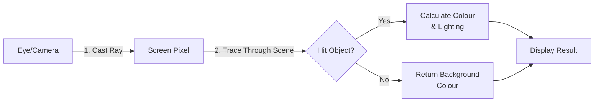
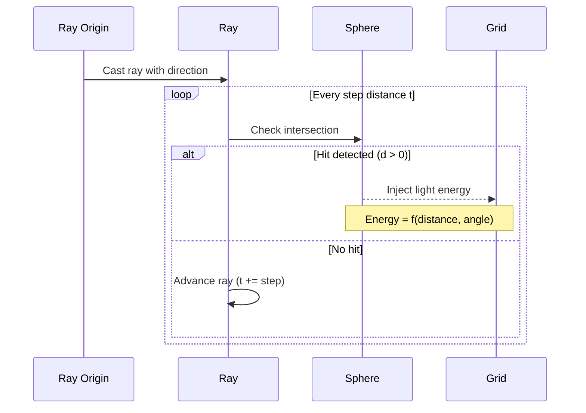

# Casting Rays

With our grid (Canvas) and maths (Vectors) established, simulation begins. The first step is locating the light.

## Reverse Ray Tracing

In reality, light travels from a bulb to your eye. In computer graphics, we work in reverse. We shoot a ray from the "Camera" (your eye) through every screen pixel to see what it strikes.



<div class="tip">

### Why Reverse?
Forward ray tracing (light → eye) is inefficient because most rays miss the camera. Reverse tracing (eye → scene) ensures every ray contributes to the image.

</div>

## The Ray Equation

A ray is defined mathematically as:

${tex`\mathbf{P}(t) = \mathbf{O} + t\mathbf{D}`}

Where:
- $\mathbf{O}$ = **Origin** (ray start position)
- $\mathbf{D}$ = **Direction** (normalised vector)
- $t$ = **Distance** along the ray
- $\mathbf{P}(t)$ = **Point** on the ray at distance $t$

```javascript
// Ray representation in code
const ray = {
    origin: {x: 0, y: 0},
    direction: {x: 1, y: 0}  // Must be normalised!
};

// Point at distance t
function rayPoint(ray, t) {
    return {
        x: ray.origin.x + t * ray.direction.x,
        y: ray.origin.y + t * ray.direction.y
    };
}
```

## Intersection: The Sphere

Our scene comprises spheres. To check if a ray hits a sphere, we use algebra. A sphere is defined as all points at a distance $r$ from a centre point $C$.

### The Math

A sphere centred at $\mathbf{C}$ with radius $r$ satisfies:

${tex`|\mathbf{P} - \mathbf{C}|^2 = r^2`}

Substituting the ray equation $\mathbf{P}(t) = \mathbf{O} + t\mathbf{D}$:

${tex`|\mathbf{O} + t\mathbf{D} - \mathbf{C}|^2 = r^2`}

This becomes a quadratic equation:

${tex`at^2 + bt + c = 0`}

Where:
- $a = \mathbf{D} \cdot \mathbf{D}$ (usually 1 if direction is normalised)
- $b = 2\mathbf{D} \cdot (\mathbf{O} - \mathbf{C})$
- $c = |\mathbf{O} - \mathbf{C}|^2 - r^2$

The **discriminant** $\Delta = b^2 - 4ac$ determines if we hit:

| Discriminant | Result |
|--------------|--------|
| $\Delta < 0$ | No intersection (ray misses sphere) |
| $\Delta = 0$ | Tangent (ray grazes sphere) |
| $\Delta > 0$ | Two intersections (ray enters and exits) |

### Implementation

This is implemented in `Scene.trace` within `src/engine.js`:

```javascript
/* src/engine.js */
trace: function(ro, rd) {
    // ...
    const oc = {x: ro.x - sphere.x, y: ro.y - sphere.y};
    const b = 2 * (rd.x * oc.x + rd.y * oc.y);
    const c = (oc.x * oc.x + oc.y * oc.y) - r * r;
    
    const d = b * b - c;
    if (d > 0) {
        const t = (-b - Math.sqrt(d)) / 2;
        // We hit the sphere at distance t!
    }
}
```

In the implementation details above:
1. We calculate coefficient $b = 2\mathbf{D} \cdot (\mathbf{O} - \mathbf{C})$
2. We calculate coefficient $c = |\mathbf{O} - \mathbf{C}|^2 - r^2$
3. We compute discriminant $\Delta = b^2 - 4ac$ (simplified since $a=1$)
4. A positive discriminant means intersection occurs
5. We solve for $t$ using the quadratic formula (taking the nearest hit)

<div class="tip">

### API Reference
See the complete implementation in [API Reference → Scene.trace](../reference/api#Scene.trace).

</div>

## Ray Marching Visualization



## Injection

When a ray strikes a light source, we "inject" that energy into our fluid grid (`State.lattice`). This initiates our fluid simulation.

```javascript
// Simplified light injection
function injectLight(hitPoint, energy) {
    const pixelX = Math.floor(hitPoint.x);
    const pixelY = Math.floor(hitPoint.y);
    const index = pixelY * WIDTH + pixelX;
    
    lattice[index * STRIDE + INTENSITY] += energy;
}
```

The injected energy then propagates via fluid dynamics (see [Chapter 6: Fluids](06-fluids)).

<div class="note">

### Performance Considerations
- **Ray count**: More rays = better quality but slower
- **Step size**: Smaller steps = more accurate but more expensive
- **Early termination**: Stop after first hit to save computation

</div>

[→ Next: Fluid Simulation](06-fluids) | [← Previous: Mathematics](04-math)
