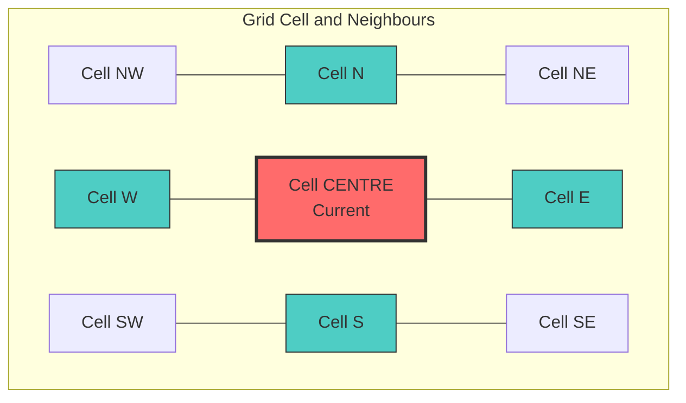

# Simulating Fluids

This is the engine's heart. After injecting light energy into the grid, we treat it as a fluid.

## The Fluid Analogy

*   **Light Intensity** ≈ **Fluid Pressure** (Quantity)
*   **Light Direction** ≈ **Fluid Velocity** (Flow direction)

This analogy allows us to use fluid dynamics algorithms to simulate light transport through 2D space.

## Cellular Automata

We use **Cellular Automata** (CA). Imagine a checkerboard where every square observes its neighbours to determine its next state.



Each cell updates based on its 4 or 8 neighbours, creating emergent behaviour from simple rules.

### Interactive Diffusion Simulation

Adjust the "Centre Brightness" to see how energy spreads to the 4 adjacent neighbours.

```js
const centerVal = view(Inputs.range([0, 100], {value: 100, step: 1, label: "Centre Brightness"}));
const diffusionRate = view(Inputs.range([0, 1], {value: 0.25, step: 0.05, label: "Diffusion Rate"}));
```

```js
const neighborVal = (centerVal * diffusionRate) / 4;
const centerRemaining = centerVal - (centerVal * diffusionRate);

display(html`<div style="display: grid; grid-template-columns: repeat(3, 60px); grid-gap: 5px; font-family: monospace; text-align: center;">
  <div></div>
  <div style="background: rgba(255, 255, 0, ${neighborVal/100}); border: 1px solid #ccc; padding: 10px;">${neighborVal.toFixed(1)}</div>
  <div></div>
  
  <div style="background: rgba(255, 255, 0, ${neighborVal/100}); border: 1px solid #ccc; padding: 10px;">${neighborVal.toFixed(1)}</div>
  <div style="background: rgba(255, 255, 0, ${centerRemaining/100}); border: 2px solid #333; padding: 10px; font-weight: bold;">${centerRemaining.toFixed(1)}</div>
  <div style="background: rgba(255, 255, 0, ${neighborVal/100}); border: 1px solid #ccc; padding: 10px;">${neighborVal.toFixed(1)}</div>
  
  <div></div>
  <div style="background: rgba(255, 255, 0, ${neighborVal/100}); border: 1px solid #ccc; padding: 10px;">${neighborVal.toFixed(1)}</div>
  <div></div>
</div>`);
```

### 1. Advection (Movement)

If a pixel has velocity pointing Right, it pushes its energy to the Right neighbour.

**Algorithm**:
```javascript
// Simplified advection
function advect(x, y) {
    const velocityX = lattice[idx + VX];
    const velocityY = lattice[idx + VY];
    
    // Move energy in direction of velocity
    const targetX = x + velocityX * dt;
    const targetY = y + velocityY * dt;
    
    // Transfer energy to target cell
    transferEnergy(current, target);
}
```

### 2. Diffusion (Spreading)

Even without velocity, energy spreads. This creates soft shadows and ambient occlusion.

**Algorithm**:
```javascript
// Simplified diffusion
function diffuse(x, y) {
    const centre = lattice[idx];
    const neighbours = [left, right, top, bottom];
    
    // Spread to neighbours
    const spreadAmount = centre * DIFFUSION_RATE;
    for (const neighbour of neighbours) {
        neighbour += spreadAmount / 4;
    }
    centre -= spreadAmount;
}
```

## Performance Metrics

### Computational Complexity

| Operation | Complexity | Per Frame (160×90 grid) | Notes |
|-----------|-----------|-------------------------|--------|
| Ray casting | O(n × s) | ~2ms (64 rays × 50 steps) | n = rays, s = steps per ray |
| Fluid diffusion | O(w × h) | ~1ms (14,400 pixels) | Single pass over active tiles |
| Advection | O(w × h) | ~0.8ms (14,400 pixels) | Backward-mapped lookup |
| Rendering | O(w × h) | ~0.5ms (14,400 pixels) | Direct pixel buffer write |
| **Total** | **O(w×h + n×s)** | **~4.3ms/frame** | **~230 FPS theoretical max** |

<div class="note">

### Real-World Performance
On a typical laptop (Intel i5, integrated graphics):
- **160×90 resolution**: 60 FPS (16ms frame budget, ~70% idle time)
- **320×180 resolution**: 35 FPS (28ms per frame)
- **640×360 resolution**: 12 FPS (83ms per frame)

The simulation is CPU-bound due to JavaScript single-threaded execution.

</div>

### Optimisation: Naive vs. Efficient

Select a tab below to compare the algorithm architectures:

```js
const viewAlgoChoice = view(Inputs.radio(["Naive", "Efficient", "Tile-Based"], {value: "Tile-Based", label: "Select Algorithm:"}));
```

```js
${viewAlgoChoice === "Naive" ? md`
#### Naive Approach

\`\`\`javascript
// O(n²) - checks every pixel pair
function naiveDiffusion() {
    for (let i = 0; i < pixels.length; i++) {
        for (let j = 0; j < pixels.length; j++) {
            if (adjacent(i, j)) {
                diffuse(i, j);
            }
        }
    }
}
// 14,400² = 207 million checks!
\`\`\`

**Performance**: Impossibly slow for real-time.
` : viewAlgoChoice === "Efficient" ? md`
#### Efficient Approach

\`\`\`javascript
// O(n) - only checks direct neighbours
function efficientDiffusion() {
    for (let y = 1; y < HEIGHT - 1; y++) {
        for (let x = 1; x < WIDTH - 1; x++) {
            const i = y * WIDTH + x;
            diffuse(i, i - 1);     // left
            diffuse(i, i + 1);     // right
            diffuse(i, i - WIDTH); // up
            diffuse(i, i + WIDTH); // down
        }
    }
}
// Only 14,400 × 4 = 57,600 operations
\`\`\`

**Performance**: 3,625× faster! Fits in 1ms frame budget.
` : md`
#### Tile-Based Approach (Current)

\`\`\`javascript
// Only processes active regions
function tileDiffusion() {
    for (const tileIndex of activeTiles) {
        const tile = getTile(tileIndex);
        for (const pixel of tile.pixels) {
            diffuse(pixel);
        }
    }
}
// Typically only ~20% of tiles active
\`\`\`

**Performance**: 5× faster than full-grid approach.
`}
```

<div class="tip">

### API Reference
- [Complete diffusion implementation](../reference/api#evolveSimulation)
- [Active region tracking and tiles](../reference/api#activateSpatialRegion)

</div>

## Interactive 1D Simulation

Below is a live version of the fluid logic running in this book.

```js
const dissipation = view(Inputs.range([0.8, 0.999], {value: 0.98, step: 0.001, label: "Dissipation (Entropy)"}));
const advection = view(Inputs.range([0.0, 5.0], {value: 3.0, step: 0.1, label: "Advection Strength"}));
const diffusion = view(Inputs.range([0.0, 1.0], {value: 0.5, step: 0.05, label: "Diffusion (Spread)"}));
```

```js
display(md`
**Current Configuration:**
*   **Energy Conservation:** ${(dissipation * 100).toFixed(1)}% energy retained per tick
*   **Flow Velocity:** ${advection.toFixed(1)} pixels/tick impact
*   **Scatter:** ${(diffusion * 100).toFixed(1)}% distribution to neighbours
`);
```

```js
function simulate1D(steps, disp, adv, diff) {
  const width = 100;
  let grid =  new Float32Array(width * 2).fill(0);
  let nextGrid = new Float32Array(width * 2).fill(0);

  // Initial Impulse
  grid[20 * 2] = 2.0; 
  grid[20 * 2 + 1] = 1.0; 

  let history = [];

  for(let t=0; t<steps; t++) {
    for(let x=0; x<width; x++) {
      const idx = x * 2;
      let energy = grid[idx];
      let velocity = grid[idx+1];

      if(energy < 0.01) continue;

      // 1. Advection (Movement)
      let thrust = velocity * adv;
      let targetX = Math.min(width-1, Math.max(0, Math.round(x + thrust)));
      
      // 2. Diffusion (Spreading)
      let remain = energy * (1 - diff);
      let spread = energy * diff;

      // Update Next State with Dissipation
      nextGrid[targetX * 2] += remain * disp;
      if(targetX + 1 < width) nextGrid[(targetX + 1) * 2] += (spread / 2) * disp;
      if(targetX - 1 >= 0)    nextGrid[(targetX - 1) * 2] += (spread / 2) * disp;

      // Decay Velocity (Viscosity)
      nextGrid[targetX * 2 + 1] += velocity * 0.9;
    }

    for(let i=0; i<width*2; i++) { grid[i] = nextGrid[i]; nextGrid[i] = 0; }
    
    let row = new Float32Array(width);
    for(let i=0; i<width; i++) row[i] = grid[i*2];
    history.push(Array.from(row));
  }
  return history;
}

const data = simulate1D(60, dissipation, advection, diffusion);
const viewChoice = view(Inputs.radio(["Visualisation", "Raw Data"], {value: "Visualisation", label: "Select View:"}));
```

```js
if (viewChoice === "Visualisation") {
  display(Plot.plot({
    marks: [
      Plot.raster(data.flat(), { width: 100, height: 60, fill: d => d, interpolate: "nearest" }),
      Plot.frame()
    ],
    color: { scheme: "magma", domain: [0, 2] },
    y: { label: "Time (t) ↓", reverse: true },
    x: { label: "Space (x) →" },
    height: 300
  }));
} else {
  display(Inputs.table(data, { rows: 15 }));
}
```

## Surface Continuity Check

In a 2D grid, light might accidentally "bleed" from a foreground object onto a background one. We prevent this with a **Surface Continuity Check**.

We examine the **Depth** (distance from the camera) of two pixels. A large difference implies distinct objects, so we block the flow of light between them.

```javascript
/* src/engine.js */
const depthDiff = Math.abs(
  State.lattice[ptr + FIELD.DEPTH] - State.lattice[nPtr + FIELD.DEPTH]
);

if (depthDiff < 0.5) {
  // Surfaces are connected! Flow energy.
  State.lattice[nPtr + FIELD.R] += State.lattice[ptr + FIELD.R] * transfer;
}
```

```js
import {marked} from "npm:marked";
const md = (strings, ...values) => {
  const raw = strings.reduce((acc, str, i) => acc + str + (values[i] !== undefined ? values[i] : ""), "");
  const div = document.createElement("div");
  div.innerHTML = marked.parse ? marked.parse(raw) : marked(raw);
  return div;
};
```
```
