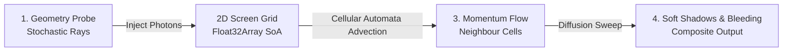

# Fluid Light Transport Engine

## Real-Time Hybrid Rendering

A high-performance **vanilla JavaScript physics engine** that treats light as a fluid substance. It combines stochastic ray tracing for photon injection with 2D cellular automata (advection and diffusion) to compute organic soft shadows, ambient occlusion, and colour bleeding.

---

## Live Visualisation

```js
const standaloneUrl = await FileAttachment("./app/index.html").url();

display(html`
  <div style="position: relative; width: 100%; border-radius: 12px; overflow: hidden; box-shadow: 0 8px 32px rgba(0,0,0,0.4); background: #000;">
    <iframe 
      id="simulation-iframe"
      src="${standaloneUrl}" 
      style="width: 100%; height: 580px; border: none; display: block;"
      title="Fluid Light Transport Visualisation">
    </iframe>
  </div>
`);
```

### Interactive Simulation Parameters

Tweak the physics engine parameters below to reactively update the live simulation above:

```js
const dissipation = view(Inputs.range([0.80, 0.99], {value: 0.97, step: 0.01, label: "Dissipation (Energy Retention)"}));
const advection = view(Inputs.range([0.0, 5.0], {value: 3.0, step: 0.1, label: "Advection Strength (Flow Speed)"}));
const decay = view(Inputs.range([0.50, 0.99], {value: 0.92, step: 0.01, label: "Momentum Decay (Viscosity)"}));
```

```js
// Send reactive parameter updates directly into the running iframe simulation
const iframe = document.getElementById("simulation-iframe");
if (iframe && iframe.contentWindow) {
  iframe.contentWindow.postMessage({
    type: 'UPDATE_CONFIG',
    config: {
      DISSIPATION: dissipation,
      ADVECTION_STRENGTH: advection,
      MOMENTUM_DECAY: decay
    }
  }, '*');
}
```

---

## How It Works: The 2-Phase Pipeline

Traditional ray tracing casts hundreds of bounces per pixel to simulate diffuse global illumination—making it computationally expensive. This engine uses a **hybrid approach**:



### Phase 1: Stochastic Ray Tracing (Photon Injection)
1. Rays are cast from the camera through the pixel grid into the 3D scene.
2. At hit points, surface normals, depth, and material roughness are calculated.
3. Light sources inject energy (colour) and directional vectors into a 2D **Structure of Arrays (`Float32Array`)** memory grid.

### Phase 2: Fluid Dynamics (Cellular Automata Propagation)
1. **Advection**: Energy flows along velocity vectors into adjacent cells.
2. **Diffusion**: Light softly spreads to 4-way orthogonal neighbours.
3. **Depth Discontinuity Protection**: Checks scene depth buffers ($\Delta \text{depth}$) to prevent light from bleeding across disconnected surfaces.

---

## Interactive Cellular Automata Toy Simulation

Below is a 1D heat-map simulation showing how energy spreads and decays across neighbouring cells according to the fluid equations:

```js
function simulate1D(steps, disp, adv) {
  const width = 80;
  let grid = new Float32Array(width * 2).fill(0);
  let nextGrid = new Float32Array(width * 2).fill(0);

  // Initial Impulse at cell index 15
  grid[15 * 2] = 2.5; 
  grid[15 * 2 + 1] = 1.2; 

  let history = [];

  for (let t = 0; t < steps; t++) {
    for (let x = 0; x < width; x++) {
      const idx = x * 2;
      let energy = grid[idx];
      let velocity = grid[idx + 1];
      if (energy < 0.005) continue;

      let thrust = velocity * adv;
      let targetX = Math.min(width - 1, Math.max(0, Math.round(x + thrust)));
      
      let remain = energy * 0.5;
      let spread = energy * 0.5;

      nextGrid[targetX * 2] += remain * disp;
      if (targetX + 1 < width) nextGrid[(targetX + 1) * 2] += (spread / 2) * disp;
      if (targetX - 1 >= 0) nextGrid[(targetX - 1) * 2] += (spread / 2) * disp;
      nextGrid[targetX * 2 + 1] += velocity * 0.9;
    }

    for (let i = 0; i < width * 2; i++) {
      grid[i] = nextGrid[i];
      nextGrid[i] = 0;
    }
    
    let row = new Float32Array(width);
    for (let i = 0; i < width; i++) row[i] = grid[i * 2];
    history.push(Array.from(row));
  }
  return history;
}

const caData = simulate1D(50, dissipation, advection);

display(Plot.plot({
  title: "1D Energy Propagation & Entropy Over Time",
  marks: [
    Plot.raster(caData.flat(), { width: 80, height: 50, fill: d => d, interpolate: "nearest" }),
    Plot.frame()
  ],
  color: { scheme: "magma", domain: [0, 2] },
  y: { label: "Time Steps (t) ↓", reverse: true },
  x: { label: "Spatial Grid (x) →" },
  height: 240
}));
```

---

## Project & Engine Integration

The physics solver (`src/app/engine.js`) is completely standalone and dependency-free:

```javascript
// Standalone usage (Zero Observable dependencies required)
import { initialiseEngine } from "./app/engine.js";

// Initialise the simulation on an HTML5 canvas element
window.CONFIG = {
  DOWNSAMPLE: 5,
  TILE_SIZE: 4,
  SCENE_URL: "/assets/scene.json"
};

initialiseEngine();
```

---

### Controls & Navigation

* **WASD**: Move camera position
* **Arrow Keys / Left-Click Drag**: Rotate view angle
* **Right-Click Drag**: Reposition primary light source
* **Spacebar**: Cycle visual debug modes (Composite Output, Energy Density, Velocity Field, Depth Buffer)
